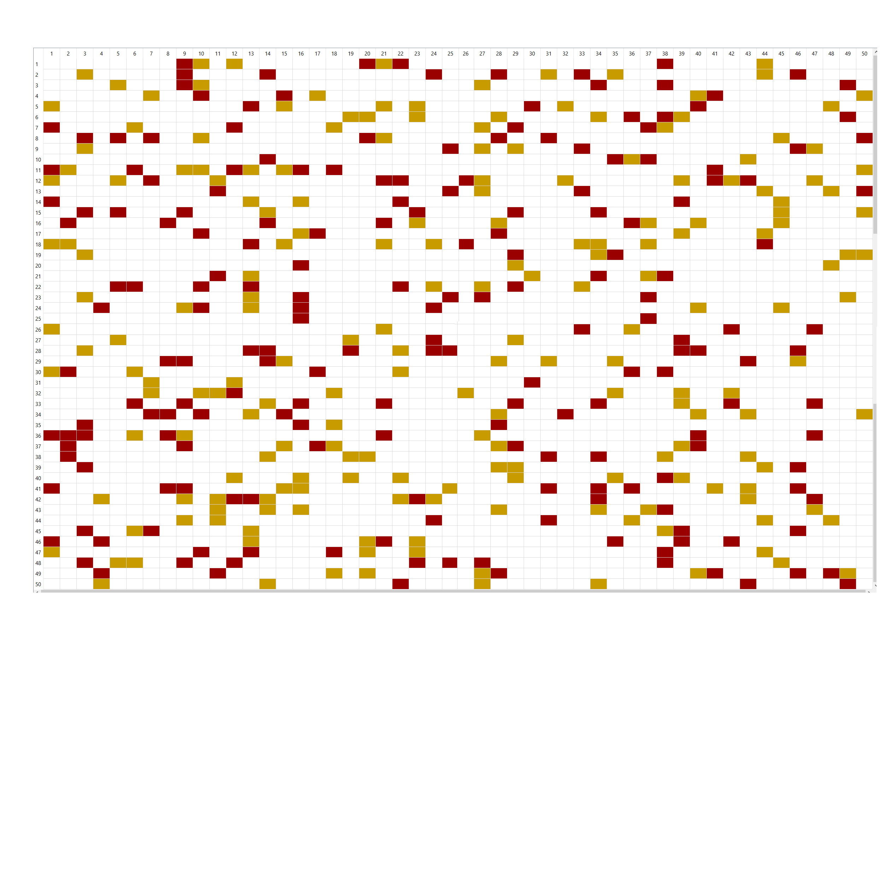
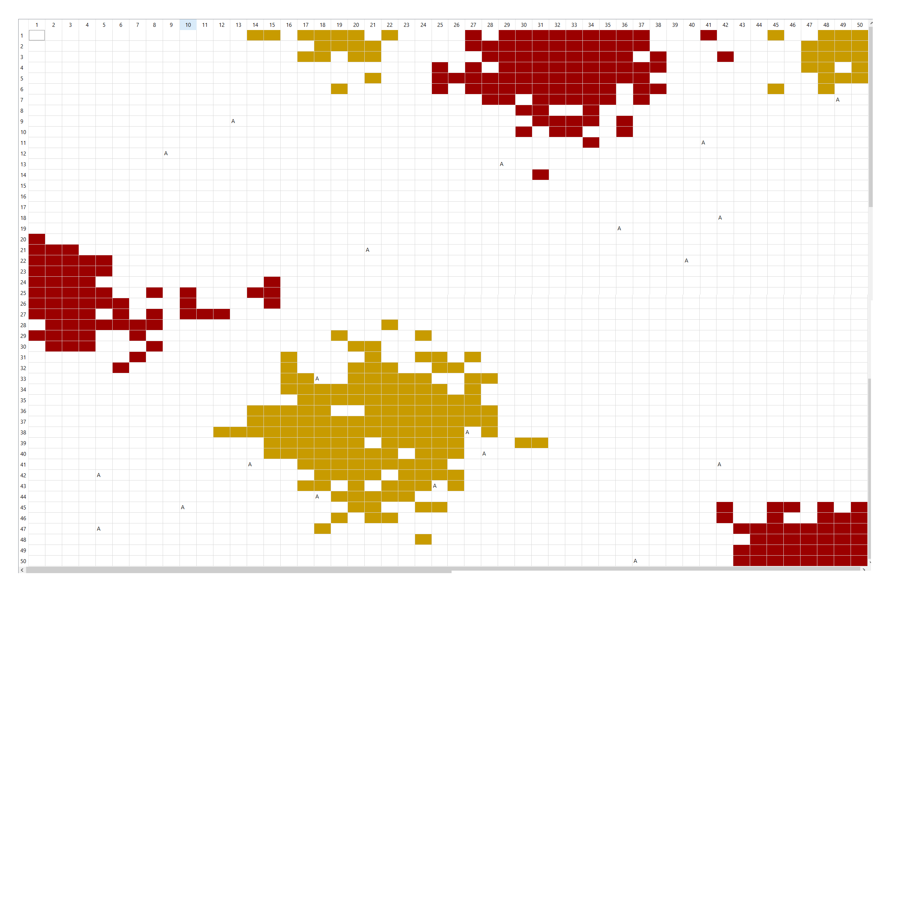
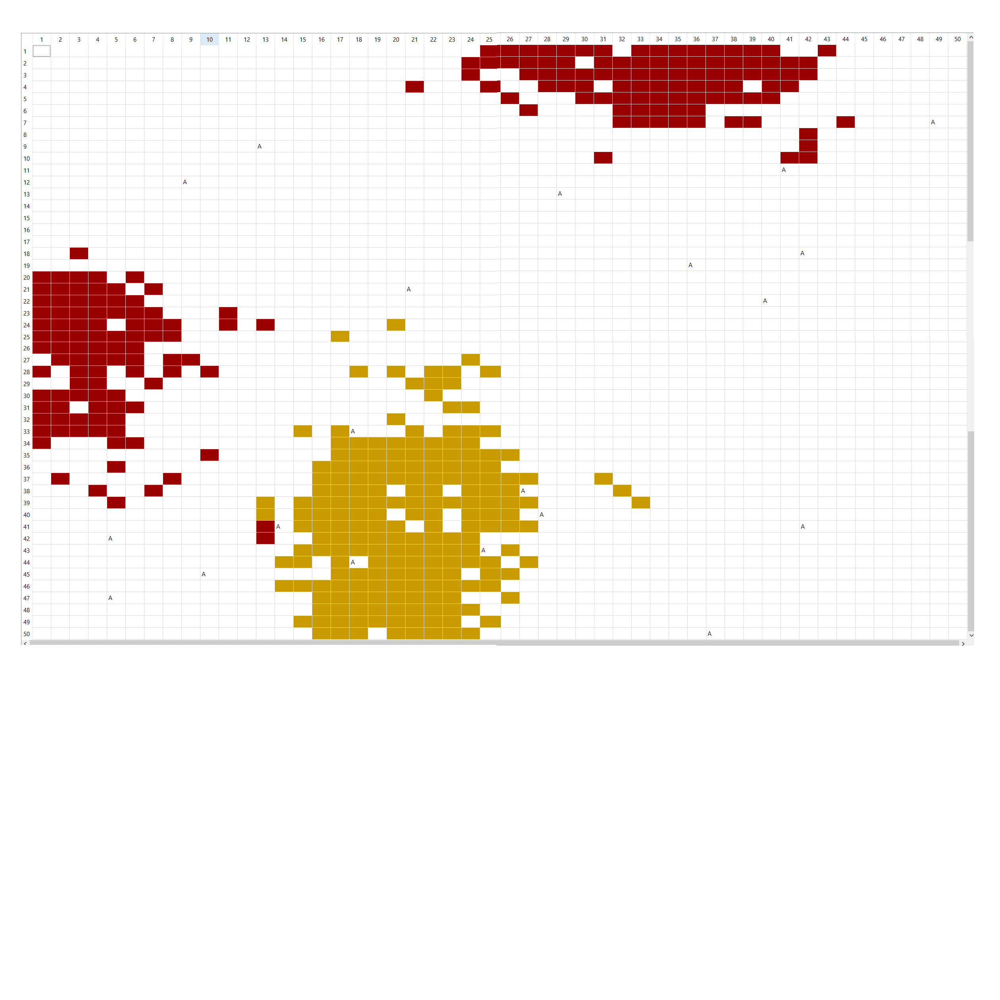

# SMA-tri-collectif

Blablabla c'est quoi le tri collectif nianianiania

##Implémentation du tri collectif

### Choix d'implémentation
Comment on a fait rapidement 

### Résultats après un million d'itération 
Etat initial

Etat intermédaire (au bout de 500 000 itérations)

Etat final

## Introduction d'un risque d'erreur sur la perception 

### Modification effectuée 

### Résultats après deux millions d'itérations et une erreur de perception de 0.1

## Analyse 
Moi je comprends pas trop ou ça veut en venir mais doit y avoir moyen de bullshit un petit truc
